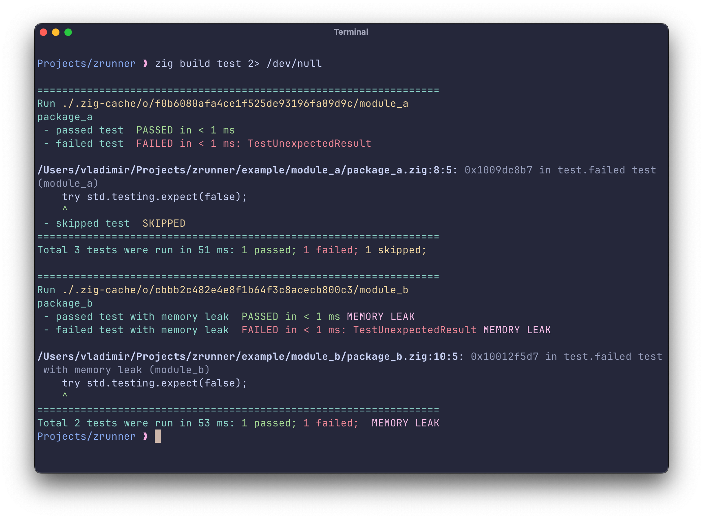
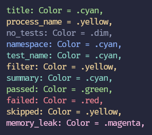
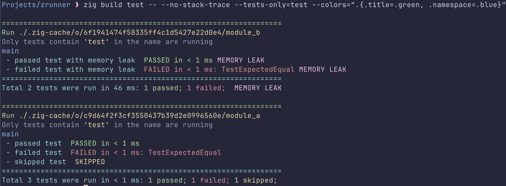

# ZRunner


A simple test runner for zig with detailed report, and support of selective running tests in modules.



## Motivation
The default zig test runner doesn't show a full list of all run tests. As a result, the report output 
is very compact, but it doesn’t indicate when some test was unexpectedly not run. The main reason why 
it could happened, the semantic analyzer doesn't see some of your dependencies (see for more details 
[refAllDecls](https://ziglang.org/documentation/master/std/#std.testing.refAllDecls) and 
[refAllDeclsRecursive](https://ziglang.org/documentation/master/std/#std.testing.refAllDeclsRecursive)).
So, the main purpose of ZRunner is showing complete test report that
mentions passed tests too.

## Features

  - Showing all tests, or failed only;
  - Customizable colorful output;
  - Flexible filters of the tests to run;
  - TODO: run tests in parallel.

## Installation

The easiest way to install this runner is copy-past `zrunner.zig` file to your
own project.

### Configuration in `build.zig`

When the `zrunner.zig` is copied to your project (assuming to the root directory) you should initialize
a new runner in your `build.zig`:

```zig
const test_runner = std.Build.Step.Compile.TestRunner{
    .path = b.path("zrunner.zig"),
    .mode = .simple,
};
```

Now you may use it in your tests:
```zig
const tests_module = b.addTest(.{
    .name = "MyTestModule",     // this helps to filter tests
    .root_module = module,
    .test_runner = test_runner, // use zrunner
});
const run_module_tests = b.addRunArtifact(tests_module);
```
It's better to setup a name for your `tests_module` explicitly. By default, all test
modules have a name "test". In multi-module project an explicit name helps to run tests
only from particular modules.

ZRunner uses [std.Io.tty](https://ziglang.org/documentation/0.15.1/std/#std.Io.tty)
to generate a colorfull output. It may be reasonable to set up an environment variable
"CLICOLOR_FORCE" to force coloring output in some cases:
```zig
run_module_tests.setEnvironmentVariable("CLICOLOR_FORCE", "true");
```
See [std.Io.tty.Config.detect](https://ziglang.org/documentation/0.15.1/std/#std.Io.tty.Config.detect)
for more details.

You can find complete example of configuration here: [build.zig](build.zig).

## Options

ZRunner supports a few run options to manage tests to run, and report output. Use
`--` to pass them to the runner (assuming your step to run tests has name "test"):
```sh
zig build test -- <put options here>
```
  * **-m &lt;str>, --modules-only=&lt;str>** Run only tests from modules whose names contain a given substring <str>.<br/> 
  Zig executes each test module as a separate console application. You can provide a substring to
  choose modules to run. For example, if you have two test modules,
  `tests_module_a` and `tests_module_b`, running: `zig build test -- --modules-only=a` will run only tests from the
  module `tests_module_a`.

  * **-t &lt;str>, --tests-only=&lt;str>** Run only tests whose names contain a given substring <str>.<br/>
  Similar to `--modules-only`, but filters tests across all modules by their original names, as defined in
  [`std.builtin.TestFn`](https://ziglang.org/documentation/0.15.1/std/#std.builtin.TestFn).

  * **--failed-only** Include in the report only failed tests.<br/>
  All test will be run, but only failed will be included to the report.

  * **--no-stack-trace** Do not print a stack trace of failed tests.<br/>
  By default, zrunner includes stack traces of failed tests in the report, but omits the first entries, 
  which typically point to lines in `std.testing.*` files. This option exclude
  stactk traces from the report at all.

  * **--colors=<zon>** Parse a &lt;zon> string as a `FileReporter.Colors` and use it in test report.
  See [colors](#colors) section for more details.

  * **--no-colors** Do not use ascii escape codes to make an output colorful. Ignore the '--colors' option.

  * **--stdout** Print output to the stdout. Default.

  * **--stderr** Print output to the stderr.

  * **--file=<file path>** Create and open a file <file path> to append a test report to it.

_You can try every provided option running tests from this [example](example/)._

## Colors

ZRunner uses [`std.Io.tty.Color`](https://ziglang.org/documentation/0.15.1/std/#std.Io.tty.Color) 
to highlight a test report output. The follow
highlight groups are used: 
  - `title`, 
  - `process_name`, 
  - `no_tests`,
  - `namespace`,
  - `test_name`,
  - `filter`,
  - `summary`,
  - `passed`,
  - `failed`,
  - `skipped`,
  - `memory_leak`.

You can override them by passing an option `--colors=<zon>`,where &lt;zon> is a
representation of the [Colors](zrunner.FileReporter.Colors) structure. For
example, let's change a couple of default colors to make highlight groups more
obvious:
```zig
zig build test -- --no-stack-trace --tests-only=test --colors=".{.title=.green, .namespace=.blue}" 2> /dev/null
```
The colors used in the output:



The output:


